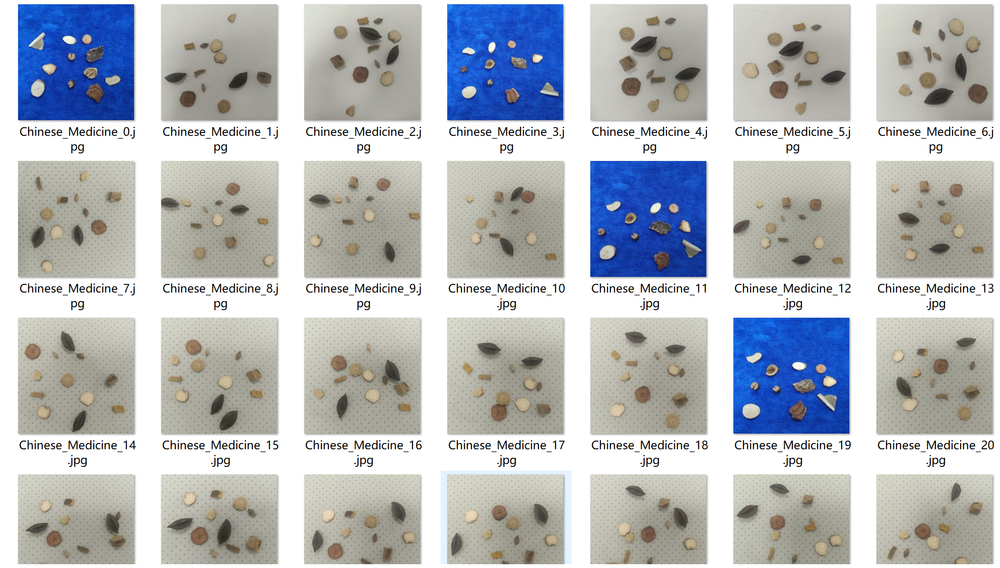
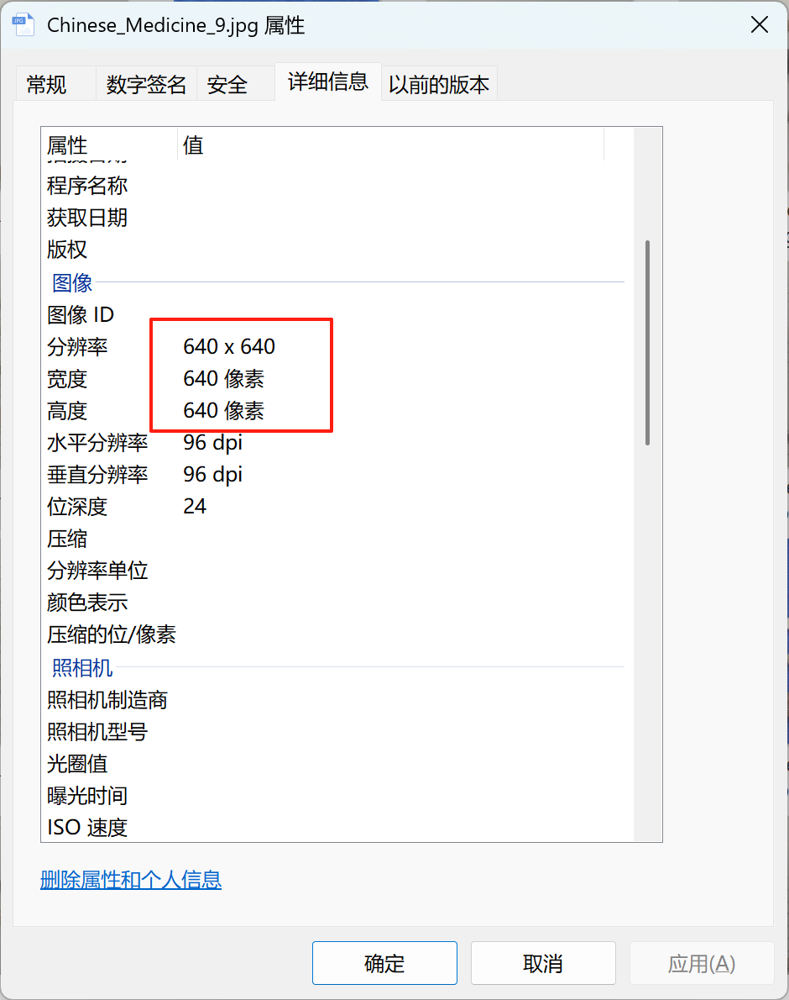
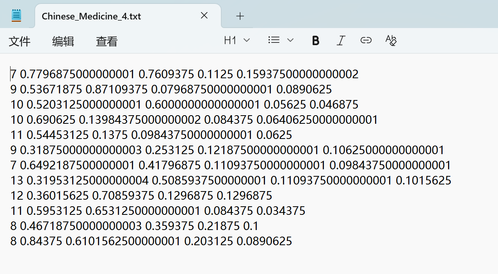
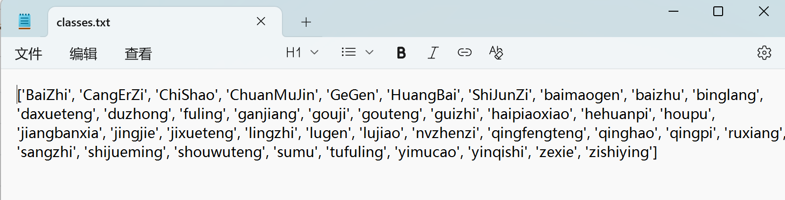
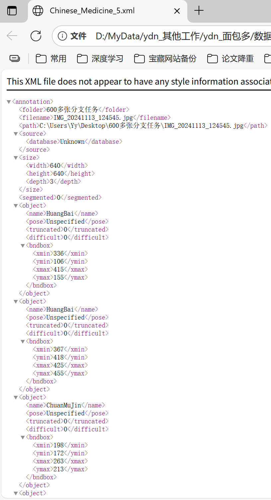
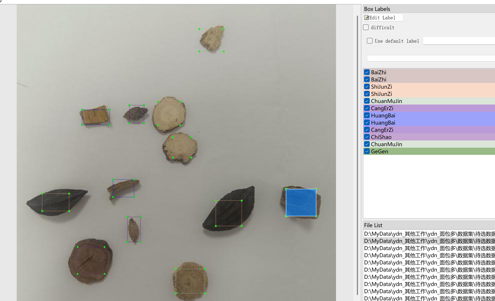

# Traditional Chinese Herbal Medicine - Object Detection Dataset

Dataset Information Introduction: The dataset consists of 1151 images and corresponding annotation files. The annotation format includes two types: VOC XML files and YOLO txt files. The objects to be detected include the following 40 types:

- BaiZhi
- CaiErZi
- ChiShao
- ChuanMuJin
- GeGen
- HuangBai
- ShiJunZi
- baimaogen
- baizhu
- binglang
- daxueteng
- duzhong
- fuling
- gangjiang
- gouji
- gouteng
- guizhi
- haipiaoxiao
- hehuanpi
- houpu
- jiangbanxia
- jingjie
- jixueteng
- lingzhi
- lugen
- lujiao
- nvzhenzi
- qingfengteng
- qinghao
- qingpi
- rumxiang
- sangzhi
- shijueming
- shouwuteng
- sumu
- tufuling
- yimucao
- yinqishi
- zexie
- zishiying

Each column has information about the image count and the number of bounding boxes: (When annotating, usually English is used with brackets for reference.)
Note: An image may contain multiple objects, so the total number of bounding boxes may be greater than the number of images.
The complete dataset consists of three folders and one txt file:
Image size information:
all_txt folder and classes.txt: Store the YOLO txt annotation files in the same quantity as the images, each annotation file corresponds to one image.
classes.txt:
For a detailed understanding of the standard YOLO format, please search on your own Baidu for "YOLO format standard". In short, the number 0 represents the name at position 0 in the array in the classes.txt file.
all_xml file: VOC XML annotation file. The number of files matches the quantity of images, each annotation file corresponds to one image.
For a detailed understanding of the standard VOC format, please search on your own Baidu for "VOC format standard".
Both formats are usable, choose one of them.
Annotation effect screenshots:

## Image

Here is a pay link on Stripe ( https://buy.stripe.com/3cs8yP7sY87d0vu9AB ). Please contact me lonlonago@foxmail.com after funding $89, and I will send you a complete data files , thank you!

